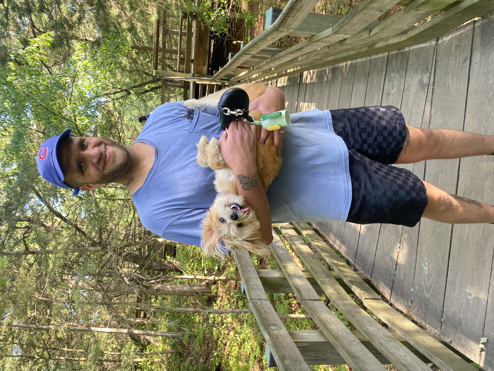
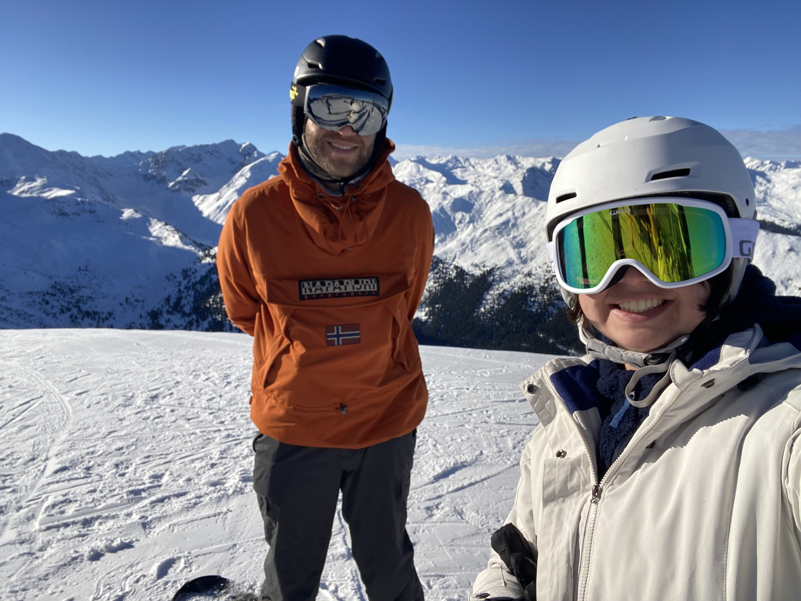

Dania Carr

 

## About Me

I am a doctoral student in the Developmental Psychology program at the University of Chicago and an Institute of Education Sciences (IES) Fellow. My research examines how socio-emotional, cognitive, and linguistic factors influence children’s mathematical thinking. 

{width=100%}

 

### Professional Interests

I am passionate about using quantitative and qualitative research methods, statistical modeling, and data visualization to identify patterns in complex datasets and translate findings into clear, actionable insights. I am interested in applying these skills in applied settings and data-focused roles that support data-driven strategy and evidence-based decision-making in the education sector.

 

### Technical Skills

#### Programming 

- R
- Python
- Git/GitHub
- SPSS
- Qualtrics

#### Visualization 

- ggplot2
- Plotly
- Tableau
- Shiny
- Interactive dashboards

#### Research Methods 

- Experimental design
- Mixed-method research
- Survey and interview analysis

#### Analytical Skills 

I love using various statistical methods to find meaningful patterns in complex datasets. I've used classical statistical analysis for hypothesis testing as well as machine learning techniques for prediction and classification. 

 

**Statistical Modeling**

- Regression modeling
- Hierarchical linear modeling
- Mixed-effects models
- Multivariate analysis
- Bayesian inference
- Dimensionality reduction (factor analysis, PCA)
- Mediation (SEM) & moderation
- Latent profile/class analysis
- k-means clustering
- Linear prediction models (OLS, regularized regression)
- Tree-based models (Random Forest, XGBoost)
- Support vector machines (SVM)

 

### Personal Interests 

I enjoy snowboarding, going to the Chicago lakefront (especially during the summer), playing pool, and hiking. I also enjoy spending time with my husband and my dog. 

  

    
    
  

 

### Contact Information

**Email:** <danias@uchicago.edu>  
